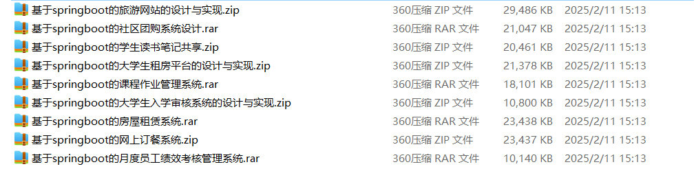

# springboot_community_trading_health_phone_sales

📦 SpringBoot多功能项目仓库 🎯

本仓库汇集了三个基于 **Spring Boot** 开发的高实用性项目，涵盖 **社区物资交易、医疗服务可视化、手机销售** 等多个领域，适用于学习、开发实践和功能拓展！🚀

🛒 **社区物资交易平台** —— 提供**商品发布、物资搜索、交易记录、支付结算、订单管理**，促进**社区物资流通** 🏠🔄

🏥 **社区医疗服务可视化系统** —— 提供**医院信息、医生排班、健康数据、医疗预约、疾病预防**等可视化功能，提升**社区医疗服务**的可访问性 📊💉

📱 **手机销售网站设计与实现** —— 支持**手机产品展示、在线支付、订单管理、用户评价**，为用户打造便捷的**手机购物体验** 📦💳

**项目部署说明**✨：

推荐使用：**谷歌浏览器**

**后台地址**😎

http://localhost:8080/springboot/admin/dist/index.html

**前台地址**😎

http://localhost:8080/springboot/front/index.html

在**src\main\resources\application.yml中**编辑数据库配置🎉										
url:jdbc:mysql://127.0.0.1:3306/springbootuseUnicode=true&characterEncoding=utf8&useJDBCCompliantTimezoneShift=true&useLegacyDatetimeCode=false&serverTimezone=UTC
username: root
password: 123456

**文档预览**👀

**其他项目合集**✨

